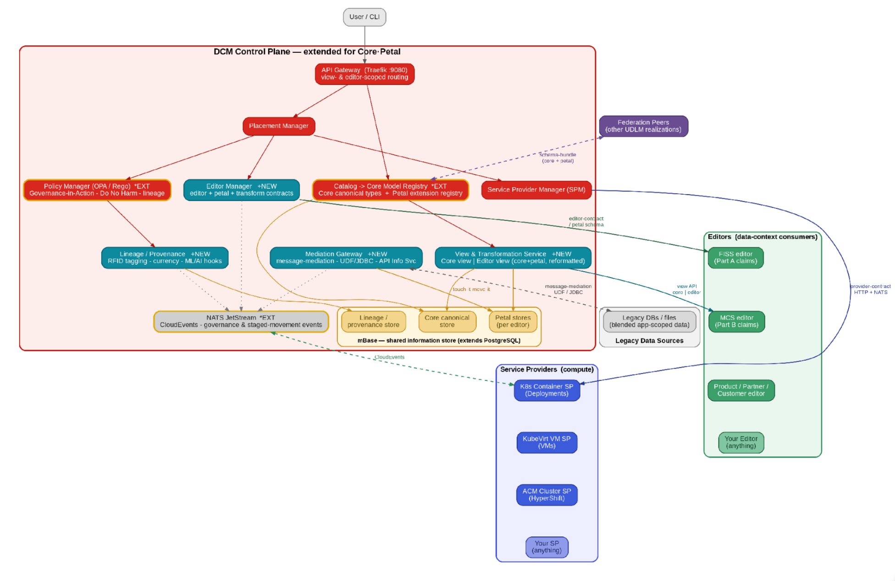

# Core·Petal ↔ DCM — integration design note

**Status:** 🅿️ **Parked** — captured design, not to be built. Activate only when a specific editor / data-modernization use case demands it (see §11). The federation protocol already carries the hard part, so the cost of waiting is near zero.
**Date:** 2026-07 (working draft) · **For:** DCM/UDLM architecture · **Settles:** *whether* Core·Petal fits DCM (it does, cleanly), *what* it would add, and *what already exists to reuse* — so that when a use case lands, the build is a re-cast, not a new platform.

Companion to the original working note (June 2026) and to UDLM's schema-sharing, layering, and data-mobility contracts. This version adds the reuse map, the UDLM/DCM boundary, and the value/gating call.

**Provenance.** The **Core·Petal / mBase (modernizationBase)** model originates with **Kevin** — the canonical-Core + per-editor-Petal framing, the retrieval views, governed staged movement ("touch-it-move-it"), and lineage are his. This note does not claim the model; it assesses how it maps onto DCM/UDLM, marks what is reuse versus net-new, and gates the build on a real use case. Credit for the idea is Kevin's; the integration analysis and boundary discipline here are the contribution.

---

## 1. Thesis — a re-cast, not a bolt-on

DCM today governs **compute**: it places and operates service providers (containers, VMs, clusters). Core·Petal gives it the same grip on **data** — a shared canonical **Core** model with per-editor **Petal** extensions, consumer-shaped **views**, governed **movement**, and **lineage** — under the *same* control plane. The integrating insight is that **a Petal is a schema extension**, and DCM's schema-sharing protocol already distributes extensions. So Core·Petal re-casts DCM's data plane in Core·Petal terms; it does not add a second platform.

## 2. The boundary — UDLM contract vs DCM runtime (ADR-008)

This is the spine the picture (§8) doesn't show: every box in the diagram is DCM runtime, but the **contract** lives in three edges. Hold this line.

| Component | UDLM (data / contract) | DCM (runtime) |
|---|---|---|
| Schema bundle Core/Petal categories | **`core_types[]` / `petal_types[]` + `owning_editor`** (schema-sharing §3/§9) | Bundle exchange + §6 unknown-type discovery |
| Editor | **`editor-contract`** (petal schema ref + transformation spec + consumed views) | **Editor Manager** — registers editors like the SPM registers providers |
| Views | view *shape* (Core / Editor projection) — reuse ADR-002 served overlay | **View & Transformation Service** (`?view=core \| editor:{id}`) |
| Movement | permission=policy, reqs=data (ADR-003); reserve→commit barrier (ADR-011) | **Mediation Gateway** — legacy access + "touch-it-move-it" |
| Lineage | field-level provenance + audit + ADR-012 references/lineage/impact | **Lineage/Provenance** — *only* the currency/value + ML-prioritization hooks are new |
| Store | store-binding contract ([D1], `key_bindings`, sovereignty) | **mBase** — Core + per-editor Petal + lineage stores (federate-don't-copy) |

**Rule:** UDLM gets the `editor-contract`, the manifest categories, and *reused* view/movement/lineage contracts. DCM gets the four managers + mBase. An Editor is a UDLM contract shape realized by a DCM manager — the same split as type-vs-provider.

## 3. What it provides, why it matters, and the condition

**Capability — a governed data plane.** Four things DCM cannot do today: (1) one canonical model many editors extend, no point-to-point integration; (2) consumer-shaped views without copies; (3) governed, lineage-tracked "touch-it-move-it" movement behind Do-No-Harm gates; (4) one provable record spanning meaning (Core) + need (Petal) + movement (lineage).

**Value.** Collapses N² data integration to N Petals over one Core; modernization without big-bang; provable lineage for regulated data (e.g. Medicare claims); unified compute + data governance under one policy engine, eventing backbone, and audit trail. And it rides existing DCM machinery, so the marginal cost is low.

**The condition.** This is the **master-data / canonical-data-model capability class** — valuable *when there is demand for it*. The novelty is doing it on DCM's federation protocol, not the pattern. So value is **use-case-gated**: with a live editor-driven program the fit is unusually clean; without one it is scope expansion that turns DCM into a data platform. **Hence: parked.**

## 4. The integrating insight — a Petal is a schema extension

Schema-sharing already states a peer "may extend udlm with custom resource types… and any peer can discover, fetch, validate, and version-negotiate those schemas." That *is* the Core·Petal contract in protocol terms: Core = the baseline/core types every peer assumes; a Petal = a peer-owned custom-type extension in that peer's bundle; "same Core + own Petal per editor" = bundle version-negotiation + §6 unknown-type discovery. The only genuinely new manifest semantic is **ownership + the core/petal distinction** — a Petal is a peer-owned extension *of a shared Core*.

## 5. Reuse map — what already exists (do not rebuild)

The largest risk is building parallel subsystems for things UDLM/DCM already have. Four of the note's "new" concerns substantially exist:

- **Lineage/Provenance** → field-level provenance (layering) + audit Merkle chain + **ADR-012 references + immutable lineage + transitive change-impact**. Reuse; add only currency/value + ML-prioritization.
- **Views (Core/Editor)** → ADR-002 served observational overlay + information-providers. A `view=core|editor:{id}` is a projection over that.
- **Staged "touch-it-move-it" movement** → ADR-003 (data mobility: reqs=data / mechanism=provider / permission=policy) + ADR-011 (reserve→commit). Map onto these, don't invent a migration engine.
- **Petal distribution** → schema-sharing bundle + semver + `schema.unknown_type` / `schema.version_incompatible`. Add only ownership/categorization.

## 6. The two UDLM deltas (the whole net-new data surface)

1. **Schema-bundle manifest** gains `core_types[]` and `petal_types[]` alongside `entity_types`; each Petal entry carries `owning_editor` + version. (schema-sharing §3/§9.)
2. **`editor-contract`** — the data-plane analogue of `provider-contract.md`: `petal_schema_ref` + `transformation_spec` + `consumed_views`. The Editor Manager registers against it exactly as the SPM registers against the provider-contract.

Everything else in the design is DCM runtime or reuse.

## 7. The DCM runtime (a future ADR-025, when un-parked)

Extended: Catalog → **Core Model Registry** (`*EXT`); Policy → governance/Do-No-Harm gates (`*EXT`); NATS → governance + staged-movement CloudEvents (`*EXT`); persistence → **mBase** (`*EXT`). New: **Editor Manager**, **View & Transformation Service**, **Mediation Gateway**, **Lineage/Provenance** (scoped per §5). These land as a DCM ADR with the required Data·Policy·Provider lens when a UC activates the work.

## 8. Integrated interface architecture

*Gold = extended existing interface (`*EXT`); teal = new (`+NEW`); the Editors plane (green) is the data-plane peer of the Service Providers plane (blue); mBase is the shared Core·Petal store. The three edges labelled `editor-contract / petal schema`, `schema-bundle (core+petal)`, and `view API core|editor` are the **UDLM contract surface** (§2); everything in the red box is DCM runtime. Note the Editors→SP edge: an Editor is a data-plane contract that MAY also be realized as a compute workload — the strongest single argument for one control plane.*

## 9. Worked example — Medicare claims (FISS / MCS)

The canonical **claim** is the Core. **FISS** (Part A) and **MCS** (Part B) register as editors: each sees the identical claim Core, contributes its own Petal of program-specific attributes, and consumes an Editor view transformed to its expected shape. Claim-intake stages (accept → consistency edits → external-file validation → batch edits) run as editor operations against the Core; results, denials, and adjustments emit as governed events with full lineage. A legacy FISS store is reached through the Mediation Gateway during transition, its records mapped to Core+Petal and moved into mBase on first touch.

## 10. Open questions (resolve when un-parked)

- Is a Petal a **type-extension** or a **layer**? (It reads as a type-extension; but per-editor reformatting resembles the layer/overlay model — pick one, or state the relationship.)
- How does central **Core-type governance** reconcile with the authority-tier model + **Petal ownership** by editors?
- Does an Editor get its own **`tenant_boundary`**, or is it a sub-scope of a tenant?
- Where does **transformation** run, and is `transformation_spec` declarative (a mapping) or a UDF reference?

## 11. Trigger to un-park

Activate when there is a **concrete editor-driven use case** — a real multi-editor canonical-data-model or legacy-modernization program (the FISS/MCS shape). At that point: mint the two UDLM deltas (§6), open DCM ADR-025 (§7) with the reuse map (§5) enforced, and anchor it on the UC's specific Core + Petals. Until then, this note is the captured design; nothing is built.
