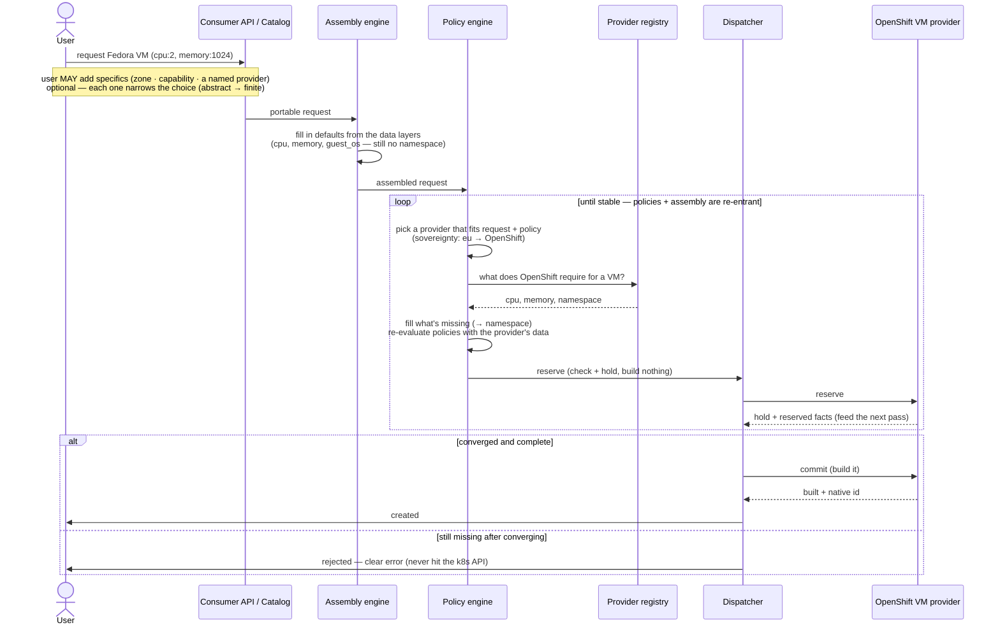

# Request realization — the play

**Purpose:** how DCM runs a request from portable intent to a built resource — the components, the sequence,
and what an engineer has to build. The worked example is Ondra's: a user asks for a VM with cpu + memory,
the system picks OpenShift, and OpenShift needs a `namespace` the request never carried. This flow shows
exactly where that value comes from. It performs the model staged in
[udlm `docs/flows/request-realization.md`](https://github.com/croadfeldt/udlm/tree/main/docs/flows/request-realization.md);
read that for *what must be true and why*.

---

## The components

| Component | What it does here | Spec |
|---|---|---|
| **Consumer API / catalog** | Takes the portable request | `docs/specifications/consumer-api-spec.md` |
| **Assembly engine** | Fills in defaults from the data layers, records where each value came from | udlm `foundations/layering-and-versioning.md` |
| **Policy engine** | Picks the provider, enriches the request, validates it (built-in or OPA) | `docs/specifications/dcm-opa-integration-spec.md` |
| **Provider registry** | Holds what each provider requires (its required-data) | `docs/specifications/dcm-registration-spec.md`, `dcm-config-projection.md` |
| **Dispatcher** | Two steps: `reserve` (check + hold, builds nothing) then `commit` (build) | udlm ADR-011; `docs/specifications/dcm-operator-sdk-api.md` |
| **State store** | Records what was asked and what was built, with provenance | udlm `foundations/four-states.md` |

---

## The sequence



---

## Walkthrough

> This is the readable walkthrough. The **authoritative** assembly process (nine steps, with the exact
> layer-resolution and policy phases) is udlm `foundations/layering-and-versioning.md` §6. Where the two
> differ, the spec wins.

1. **Request.** The user picks the *Fedora VM* catalog item and sets `cpu: 2, memory: 1024`. That's all —
   the portable base is enough, so the user is never *required* to give a namespace. (They *may* supply
   provider-specific extensions like a namespace right in the request; DCM honors them and flags the request
   non-portable. This example takes the common path where they don't and leave it to the system.)

2. **Assemble.** The assembly engine fills in defaults from the data layers (platform, profile, tenant),
   with the user's own values on top, and records where each value came from. Now it has cpu, memory,
   guest_os — still **no namespace**, because no layer on a portable type carries a provider-specific field.

3. **Place.** The policy engine keeps the providers that satisfy the request and policy, then picks one. The
   user pinned nothing beyond cpu + memory, so both OpenShift and VMware qualify, and the sovereignty rule
   (`eu → openshift`) settles it on **OpenShift**. Had the user pinned a specific — a GPU class, a zone, a
   named provider — that would have trimmed the list before policy ran. The decision is recorded. Only now,
   with a provider chosen, does DCM know what it requires. (See
   [Placement across the specificity scale](#placement-across-the-specificity-scale).)

4. **Enrich.** DCM reads what OpenShift requires for a VM (`cpu, memory, namespace`), sees that `namespace`
   is missing, and fills it — writing the value into `provider_extensions.openshift.namespace` and moving
   `enrichment_status` to `complete`. **This is where the namespace comes from.** *How* it's filled is the
   org's choice (next section); the common case is a small enrichment policy:

   ```yaml
   # docs/specifications/dcm-opa-integration-spec.md — an enrichment policy
   policy_artifact:
     handle: "enrichment/openshift-vm-namespace"
     policy_type: transformation
     match:
       conditions:
         - field: placement.selected_provider_type
           operator: equals
           value: "openshift-virtualization"
         - field: request.resource_type
           operator: equals
           value: "Compute.VirtualMachine"
     mutations:
       - field: provider_extensions.openshift.namespace
         operation: set
         value: "${tenant.handle}"          # the org's rule: namespace = the tenant
         reason: "OpenShift requires a namespace; use the owning tenant's"
         source_type: injection
   ```

   VMware would have a sibling policy filling `cluster` instead — same step, different field. The portable
   VM never changes.

5. **Reserve — the check before building.** The dispatcher sends the filled-in request to OpenShift as a
   `reserve`: the provider checks it against its own requirements **without building anything** (ADR-011).
   This runs as a loop, not a single check — the policy and assembly engines are **re-entrant** (udlm
   ADR-006), so reserving lands facts that can re-trigger enrichment and policy re-evaluation, converging
   before commit (the `loop` in the diagram). All present → it holds a spot. Something missing → `reserve`
   fails with the exact field, and the user gets a clear error. **An incomplete VM never reaches the k8s API.**

6. **Commit — build it.** On a held spot, the dispatcher calls `commit`; OpenShift creates the VM in its
   namespace, reports back what it built and the id linking the UDLM record to the k8s object, and DCM
   records the result. What was asked and what was built are both stored, so they can be compared later.

---

## Where the value comes from

The value lives in **data**; a **policy selects it**. That's the model's original split — *layers set the
stage for data, policies refine and validate it* (udlm [ADR-024](https://github.com/croadfeldt/udlm/tree/main/docs/adr/ADR-024-filling-provider-required-inputs.md)).
A governed layer holds the values — the tenant's namespace, or a table of `provider → value` — and the
post-placement enrichment policy (the YAML above) looks up the right one for the chosen provider and injects
it. The value stays data; the only logic is the lookup. One generic lookup policy covers every
provider-required field; adding a provider is a new data row, not a new rule.

If the table has no entry for the chosen provider, the policy gates with a reason ("no namespace mapping for
OpenShift VMs") — caught at reserve, not a silent miss. A plain layer default still serves fields that aren't
provider-conditional.

Precedence follows the layer merge rules (udlm `layering-and-versioning.md` §5–§5a): data-layer defaults
first, the consumer's own value overrides those if supplied (a provider-specific extension at intent —
honored, flagged non-portable), the enrichment policy fills what's still missing, and compliance policies can
override anything for sovereignty/security. Guideline: keep the value in a governed layer and let a policy
select it (auditable, reviewable); reserve provider-side derivation for values only the provider can know at
build time.

---

## Placement across the specificity scale

The user chooses how much to pin down, and the engine does a bit less work as they pin more — but the
downstream steps don't change. (The model's telling is the UDLM
[specificity scale](https://github.com/croadfeldt/udlm/tree/main/docs/flows/request-realization.md#the-specificity-scale).)

| Request | Example (same VM) | What the engine does |
|---|---|---|
| **Abstract** | `cpu:2, memory:1024` | Score every eligible provider, pick the best |
| **Partial** | `…, residency: eu, storage_class: nvme` | Filter to the providers that fit, then score + pick among them |
| **Finite** | `…, placement.provider: openshift-mn` | Just check the named provider is allowed — no scoring |

- **Abstract → the engine decides.** No placement constraints from the user; score the whole eligible pool
  (cost, capacity, capability, affinity) and pick. This is the walked example.
- **Partial → the engine decides within a smaller set.** The user's constraints trim the list *before*
  scoring. If the trim leaves nothing, the request fails at placement with the unmet constraint — not later.
- **Finite → the engine just checks.** The user named the provider; the engine confirms it's allowed
  (capability, capacity, policy) and either proceeds or rejects with the failing check. Naming a provider is
  a request, not a way around policy — a finite request can still be denied.

Whatever the specificity, once a provider is chosen the rest is the same: enrich the missing fields, then
reserve to check completeness. Specificity changes *how the provider is chosen*, never *what happens after*.

---

## What an engineer builds

The flow itself is contracted; these are the pieces a deployment supplies:

- **The provider's required-data** — at registration, the OpenShift provider declares what it needs for a
  VM, including `namespace` (`dcm-registration-spec.md`). This is what turns a missing field into a
  checkable requirement instead of a surprise at build time.
- **The fill for each required field** — a layer default, an enrichment policy, or a plain default (see
  [Where the value comes from](#where-the-value-comes-from)) for every field the portable type doesn't carry.
- **Nothing else about the flow** — assembly, placement, reserve/commit are the engine's; the deployment
  only supplies the provider's requirements and how to meet them.

---

## When it goes wrong

- **A required field with no way to fill it** — the provider requires something no layer, policy, or default
  supplies. Today this is caught at **reserve**, before anything is built. *Worth adding:* check this at
  registration time, so it's caught when the provider is set up, not on a user's request.
- **No provider fits** — placement finds none that satisfy the request and policy; it fails there, with the
  unmet constraint, before any provider-specific work.
- **Something only knowable after build** — a few provider fields can't be filled until the resource exists;
  those are completed from the build result or discovery, and `enrichment_status` stays `partial` until
  then. Reserve still checks everything needed *to build*.

---

## Pointers

- **The stage (what must be true):** [udlm `docs/flows/request-realization.md`](https://github.com/croadfeldt/udlm/tree/main/docs/flows/request-realization.md)
- Provider-specific config off the portable type — udlm ADR-016; `PRV-010`
- What a provider requires — udlm `contracts/provider-contract.md` §base-level #2; `dcm-registration-spec.md`
- Data layers + enrichment — udlm `foundations/layering-and-versioning.md`
- Enrichment as a policy — udlm `contracts/policy-contract.md` §12; `dcm-opa-integration-spec.md`
- Reserve then commit — udlm ADR-011; `dcm-operator-sdk-api.md`
