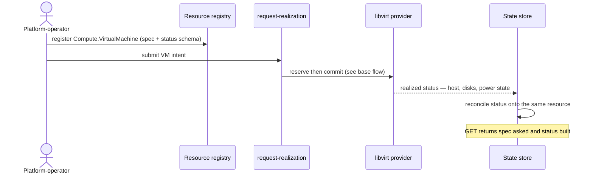

# UC-01 · VM as a first-class resource — the play

**Purpose:** how DCM runs this case, on top of [request-realization](request-realization.md) — only the UC-specific mechanics. Here that's the registration of the `Compute.VirtualMachine` type and the reconciliation of libvirt's realized status back onto the resource.

> **Use Case:** `libvirt-vm-provider/standard/vm-resource-representation` · **Persona:** platform-operator.

## What's different in the engine

- **Type registration, then instances.** Before any request, the platform-operator registers the `Compute.VirtualMachine` type (spec schema + status schema) in the resource registry. request-realization then runs unchanged for each instance.
- **Status reconciliation loop.** After commit, the libvirt provider reports realized facts; DCM writes them to the resource's status subresource and keeps them reconciled on drift — the piece request-realization only records once at commit.
- **One record, two sides.** Spec (asked) and status (built) are stored on the same resource so `GET` returns both.

## Sequence — only the UC-specific part

## What an engineer adds

- The `Compute.VirtualMachine` spec and status schemas at registration time.
- A status-reconcile handler that maps libvirt native facts onto the resource's status subresource — nothing else in the base flow changes.

## Pointers

- Stage: [udlm request-realization](https://github.com/croadfeldt/udlm/tree/main/docs/flows/request-realization.md). UC source: `libvirt-vm-provider/standard/vm-resource-representation`.
