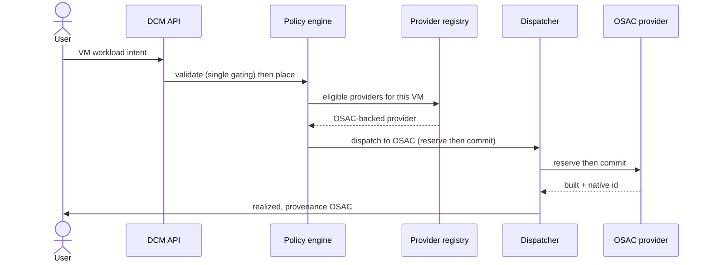

# UC-02 · VM intent onto OSAC — the play

**Purpose:** how DCM places a VM intent onto an **OSAC-backed provider** on top of
[request-realization](request-realization.md) — proving OSAC participates through the ordinary provider
contract, with DCM as the control plane. Only the OSAC-specific mechanics are here; the base pipeline lives in
request-realization.

> **Use Case:** `compute/vm-intent-osac-placement` · **Persona:** application-team-member.

## What's different in the engine
- **OSAC is a registered provider.** It appears in the provider registry with its required-data like any
  other. Placement selecting it is the ordinary selection step, not a special integration.
- **Validation gates before placement.** A single gating policy runs before the placement engine selects
  (`policy_complexity: single_gating`).
- **Provenance names OSAC.** On commit, DCM records the `Realized` state with provider provenance identifying
  the OSAC-backed provider — a checked outcome, not just a log.
- **Dispatch is the standard reserve→commit** against the OSAC provider adapter.

## Sequence — only the UC-specific part

## What an engineer adds
- **OSAC provider registration** — its required-data and adapter, so placement can select and dispatch to it.
- **The gating validation policy** that must pass before placement.
- **Provenance capture** wiring OSAC's identity into the `Realized` record. No changes to the base pipeline.

## Pointers
- Stage: [udlm request-realization](https://github.com/croadfeldt/udlm/tree/main/docs/flows/request-realization.md). UC source: `compute/vm-intent-osac-placement`.
