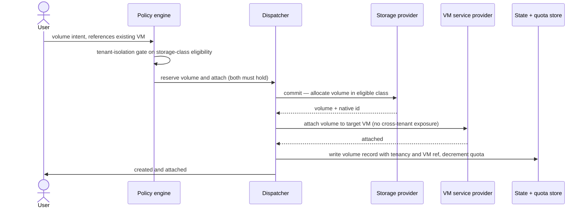

# UC-03 · Persistent volume with attach — the play

**Purpose:** how DCM provisions a block volume **and attaches it to an existing VM** on top of
[request-realization](request-realization.md). The new mechanics are the cross-resource reference, the
tenant-isolation gate on storage class, the two provider calls, and quota accounting; the base pipeline lives
in request-realization.

> **Use Case:** `data/persistent-volume-provision` · **Persona:** application-team-member.

## What's different in the engine
- **A dependency in the payload.** The request carries a reference to an existing `Compute.VirtualMachine`
  (`resource_complexity: cross_dependency_payload`). Placement and reserve must resolve that reference before
  the volume can be attached.
- **Tenant-isolation gate.** A Validation Policy checks the request against the tenant's storage-class eligibility
  before allocation — and the attach must not expose the volume across tenants.
- **Two provider interactions.** The storage provider allocates the volume; a service provider attaches it to
  the VM. Reserve confirms both are satisfiable before either commits.
- **Quota decrement.** On commit, the tenant's quota is updated and the volume record is written with tenancy
  and the VM reference.

## Sequence — only the UC-specific part

## What an engineer adds
- **The tenant-isolation policy** gating storage-class eligibility (and any data-residency constraint).
- **Storage + attach provider registrations** with their required-data.
- **Quota accounting** wired to the commit, and the volume record's tenancy + VM reference.

## Pointers
- Stage: [udlm request-realization](https://github.com/croadfeldt/udlm/tree/main/docs/flows/request-realization.md). UC source: `data/persistent-volume-provision`.
