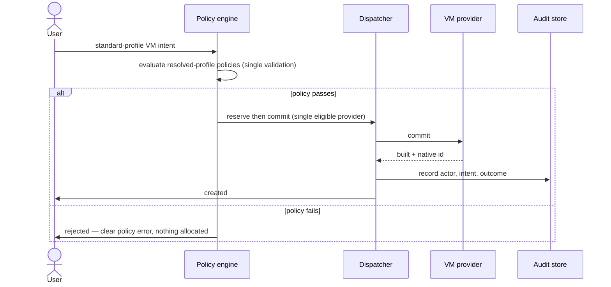

# UC-03 · Standard VM provision — the play

**Purpose:** how DCM runs the plainest case — standard profile, one eligible provider, one policy check — on
top of [request-realization](request-realization.md). The only mechanics this UC adds are the
**pre-allocation policy gate** and the **audit record**; the base pipeline (assemble/place/enrich/reserve/commit)
lives there.

> **Use Case:** `compute/vm-standard-provision` · **Persona:** application-team-member.

## What's different in the engine
- **Placement has one candidate.** `provider_landscape: single_eligible` — the policy engine still runs
  placement, but the eligible set has one member. No scoring to speak of.
- **Policy gate before allocation.** The resolved standard-profile policy set (`single_validation`) is
  evaluated before reserve. Pass → proceed; fail → stop with a field-level policy error, nothing allocated.
- **Audit write is part of done.** On commit, DCM writes an audit event carrying **actor · intent · outcome** —
  a required outcome here, not an incidental log line.
- **Idempotency** is guaranteed but implemented by the reconvergence path — see [UC-05](uc-13-vm-lifecycle-reconciliation.md).

## Sequence — only the UC-specific part

## What an engineer adds
- The **standard profile's resolved policy set** (the single validation that must pass pre-allocation).
- The **audit binding** — actor · intent · outcome written on the realization event.
- Nothing new for assembly, placement, or reserve/commit — those are the base engine.

## Pointers
- Stage: [udlm request-realization](https://github.com/croadfeldt/udlm/tree/main/docs/flows/request-realization.md). UC source: `compute/vm-standard-provision`.
