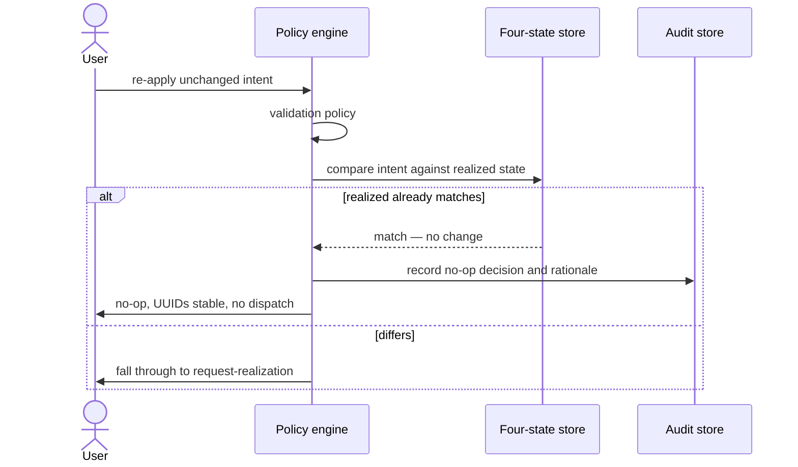

# UC-05 · Idempotent reconvergence — the play

**Purpose:** how DCM turns a re-applied, unchanged intent into a **no-op** — on top of
[request-realization](request-realization.md). The only new mechanic is the intent-vs-realized compare that
short-circuits before dispatch; the base pipeline lives in request-realization.

> **Use Case:** `compute/idempotent-reconvergence` · **Persona:** application-team-member.

## What's different in the engine
- **A modification, not a new request.** `lifecycle_phase: modification` — the resource already exists and the
  four-state stores are populated.
- **Compare before dispatch.** After validation, DCM compares the incoming intent against the current realized
  state. Equal → short-circuit: no reserve, no commit, no provider call.
- **Stable identity.** Resource UUIDs are not reassigned on a no-op.
- **The no-op is audited.** The decision and its rationale ("realized already matches intent") are recorded.
- On a **mismatch**, DCM falls through to the ordinary request-realization pipeline.

## Sequence — only the UC-specific part

## What an engineer adds
- **The intent-vs-realized equivalence check** that gates dispatch (and defines what "unchanged" means).
- **The no-op audit record** — decision plus rationale.
- Nothing else — the mismatch path reuses the base pipeline unchanged.

## Pointers
- Stage: [udlm request-realization](https://github.com/croadfeldt/udlm/tree/main/docs/flows/request-realization.md). UC source: `compute/idempotent-reconvergence`.
