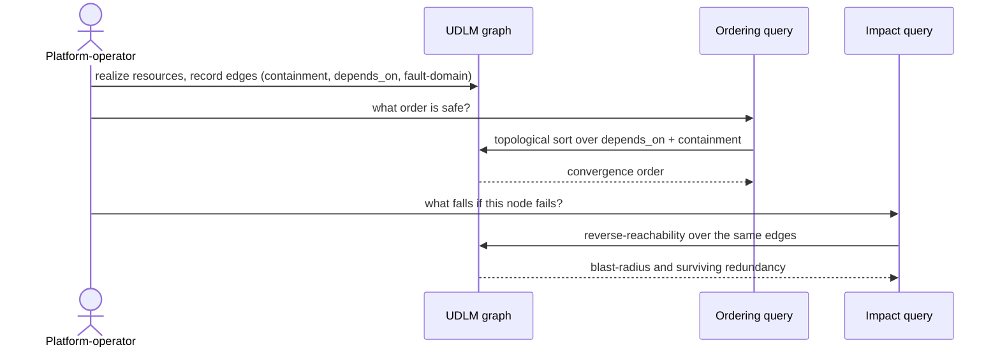

# UC-07 · Dependency graph as first-class data — the play

**Purpose:** how DCM runs this case, on top of [request-realization](request-realization.md) — only the UC-specific mechanics. Here that's reading ordering and impact *out of* the UDLM graph rather than maintaining a separate dependency map.

> **Use Case:** `dcm-core/standard/udlm-dependency-graph-data-model` · **Persona:** platform-operator.

## What's different in the engine

- **No parallel dependency store.** DCM queries the UDLM graph directly for the three edge kinds — containment, `depends_on`, shares-fault-domain — instead of building its own.
- **Two derived reads, one source.** A topological sort over `depends_on` + containment yields convergence order; a reverse-reachability walk over the same edges yields blast-radius and redundancy.
- **Edges written where they're known.** Containment and fault-domain edges are recorded at realization (which host, which pool); `depends_on` edges come from the resource spec.

## Sequence — only the UC-specific part

## What an engineer adds

- Population of the three edge kinds as resources realize — no separate ordering table.
- Two graph queries (topological sort, reverse-reachability) that read the UDLM graph as their only source of truth.

## Pointers

- Stage: [udlm request-realization](https://github.com/croadfeldt/udlm/tree/main/docs/flows/request-realization.md). UC source: `dcm-core/standard/udlm-dependency-graph-data-model`.
