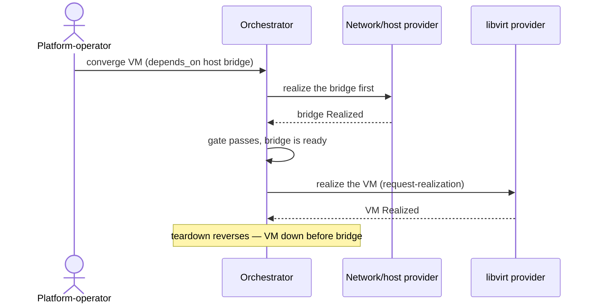

# UC-08 · Cross-provider ordering — the play

**Purpose:** how DCM runs this case, on top of [request-realization](request-realization.md) — only the UC-specific mechanics. Here that's sequencing convergence across provider boundaries from the `depends_on` graph, with a gate that blocks on unrealized prerequisites.

> **Use Case:** `libvirt-vm-provider/standard/cross-provider-dependency-ordering` · **Persona:** platform-operator.

## What's different in the engine

- **An orchestrator over per-resource realization.** DCM topologically sorts the `depends_on` graph (UC-07) and dispatches each resource's request-realization in order — even when prerequisite and dependent have different owning providers.
- **A readiness gate, not a skip.** Before dispatching the VM, DCM checks the bridge is Realized. Not yet — it blocks and re-checks; it never proceeds without the prerequisite.
- **Reverse on teardown.** The same sort, reversed: dependents down before prerequisites.

## Sequence — only the UC-specific part

## What an engineer adds

- A topological dispatcher over the `depends_on` graph that spans providers.
- A prerequisite-readiness gate that blocks (and re-checks) rather than skips, plus the reverse ordering for teardown.

## Pointers

- Stage: [udlm request-realization](https://github.com/croadfeldt/udlm/tree/main/docs/flows/request-realization.md). UC source: `libvirt-vm-provider/standard/cross-provider-dependency-ordering`.
