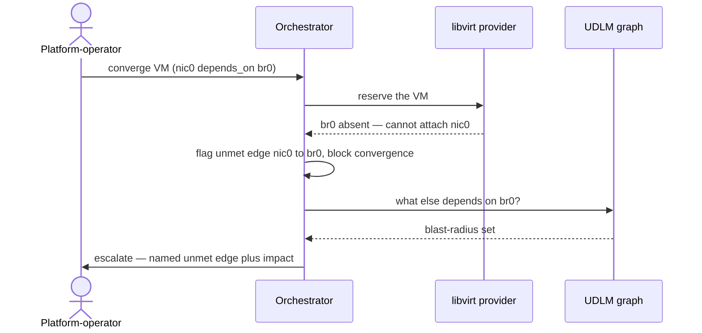

# UC-09 · Broken dependency, surfaced — the play

**Purpose:** how DCM runs this case, on top of [request-realization](request-realization.md) — only the UC-specific mechanics. Here that's turning an absent prerequisite into a named, blocking, escalated unmet edge with a derivable blast-radius.

> **Use Case:** `libvirt-vm-provider/standard/dependency-failure-impact` · **Persona:** platform-operator.

## What's different in the engine

- **Unmet-edge detection at the gate.** The UC-08 readiness gate, when the prerequisite can't be resolved, produces a specific diagnostic — which edge, which target — rather than a generic reserve failure.
- **Block and escalate.** Policy here is `human_escalation_required`: DCM holds the VM and raises the unmet edge to an operator instead of retrying blindly or building anyway.
- **Impact from the graph.** A reverse-reachability query over the same edges (UC-07) answers "what else needs `br0`" so the operator sees the blast-radius, not just the one VM.

## Sequence — only the UC-specific part

## What an engineer adds

- A diagnostic path that maps a provider "prerequisite absent" into a named unmet edge and escalates it.
- Reuse of the UC-07 reverse-reachability query to attach blast-radius to the escalation — no new impact store.

## Pointers

- Stage: [udlm request-realization](https://github.com/croadfeldt/udlm/tree/main/docs/flows/request-realization.md). UC source: `libvirt-vm-provider/standard/dependency-failure-impact`.
