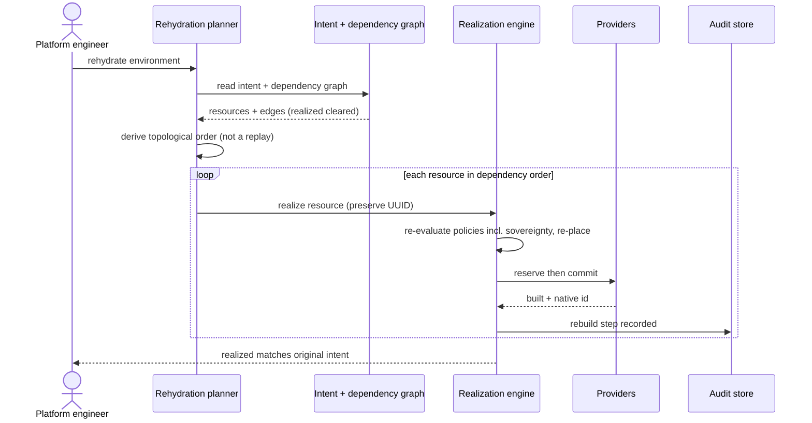

# UC-10 · Dynamic rehydration — the play

**Purpose:** how DCM rebuilds a whole environment from stored intent, on top of
[request-realization](request-realization.md) — only the UC-specific mechanics.

> **Use Case:** `cross-domain/dynamic-rehydration` · **Persona:** platform-engineer.

## What's different in the engine
- **A planner sits in front of the normal engine.** It reads the intent store and the dependency graph and
  produces a topological rebuild order. There is no action replay — the order is computed at rebuild time, so
  it reflects current policy and the currently registered providers.
- **The per-resource path is the ordinary one.** For each resource in order, DCM runs the standard
  assemble → place → enrich → reserve → commit. Placement re-scores; sovereignty and the other validation
  policies re-evaluate. A resource may legitimately land on a different provider than before.
- **UUIDs are carried, not minted.** The rebuild reuses each resource's stored UUID so cross-resource
  references resolve and the rebuilt graph is identity-stable.
- **Ordering gates on readiness.** A dependent is only dispatched once its dependencies report realized, so the
  graph edges become the scheduler's wait conditions.

## Sequence — only the UC-specific part

## What an engineer adds
- The **rehydration planner** — graph read plus topological ordering with readiness gating. The realization
  engine, placement, and providers are reused unchanged.
- **UUID preservation** through the realize path so identity survives the cycle. Everything else is request-realization.

## Pointers
- Stage: [udlm request-realization](https://github.com/croadfeldt/udlm/tree/main/docs/flows/request-realization.md). UC source: `cross-domain/dynamic-rehydration`.
