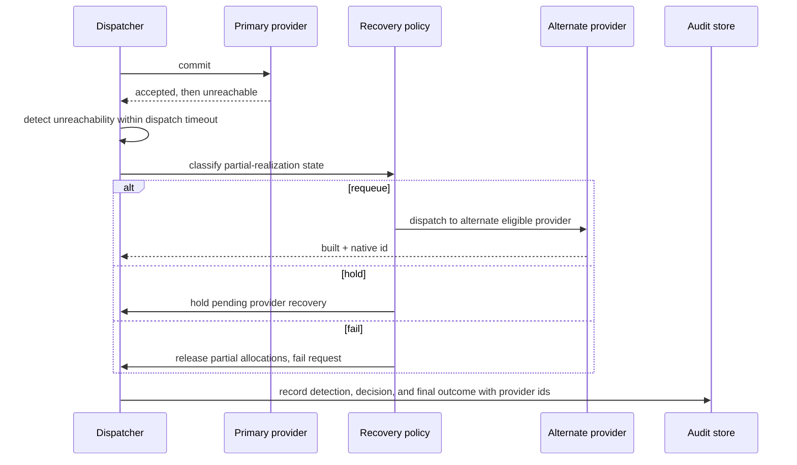

# UC-11 · VM provision, provider fails mid-realization — the play

**Purpose:** how DCM recovers when a provider **accepts the dispatch then goes unreachable** — on top of
[request-realization](request-realization.md). Everything through dispatch is the base pipeline; the new
mechanics are timeout detection, the recovery policy, and clean reconciliation of partial state.

> **Use Case:** `compute/vm-provision-with-provider-failure` · **Persona:** application-team-member.

## What's different in the engine
- **A dispatch timeout bounds the wait.** The dispatcher detects unreachability within the timeout rather than
  hanging on a pending commit.
- **A recovery policy decides.** It classifies the partial-realization state and picks **requeue / hold /
  fail** (`policy_complexity: recovery_policy`). The decision is audit-recorded.
- **Multiple eligible providers.** `provider_landscape: multiple_eligible` — so requeue onto an alternate is a
  real path when policy permits.
- **No orphaned state.** Partial allocations are reconciled to complete or cleanly released; the requested
  state never shows an indeterminate resource without a matching recovery record.

## Sequence — only the UC-specific part

## What an engineer adds
- **The recovery policy** — classification of partial state plus the requeue / hold / fail decision rules.
- **A dispatch timeout** on the provider adapter, and the reconcile/release path for partial allocations.
- **Recovery-record + audit** capture, naming both provider identities.

## Pointers
- Stage: [udlm request-realization](https://github.com/croadfeldt/udlm/tree/main/docs/flows/request-realization.md). UC source: `compute/vm-provision-with-provider-failure`.
