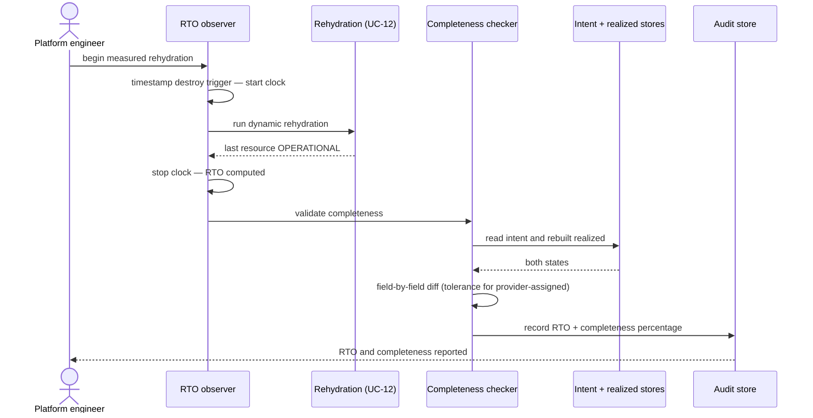

# UC-13 · Rehydration RTO measurement — the play

**Purpose:** how DCM measures and validates a rehydration, on top of
[request-realization](request-realization.md) and [UC-12](uc-12-dynamic-rehydration.md) — only the
UC-specific mechanics.

> **Use Case:** `observability/rehydration-rto-measurement` · **Persona:** platform-engineer.

## What's different in the engine
- **An observer brackets the rehydration.** It timestamps the destroy trigger and watches resource status,
  stopping the clock when the last resource reports `OPERATIONAL`. The RTO is that interval — one number for
  the environment.
- **A completeness checker diffs intent against realized.** It walks every resource in the original intent,
  confirms a matching rebuilt realized record, and compares fields. Provider-assigned fields (native ids,
  addresses) are compared under tolerance rather than for exact equality.
- **Results are recorded, not acted on.** RTO and the completeness percentage are written to the audit trail.
  This UC triggers no remediation and no provider calls of its own.

## Sequence — only the UC-specific part

## What an engineer adds
- The **RTO observer** (trigger timestamp plus an `OPERATIONAL` watch across all resources) and the
  **completeness checker** with its provider-assigned-field tolerance rules.
- The **audit write** for RTO and completeness. No changes to realization or rehydration themselves.

## Pointers
- Stage: [udlm request-realization](https://github.com/croadfeldt/udlm/tree/main/docs/flows/request-realization.md). UC source: `observability/rehydration-rto-measurement`.
