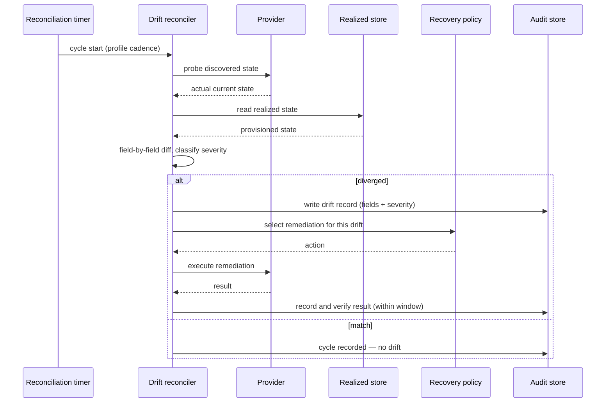

# UC-14 · Drift detection & remediation — the play

**Purpose:** how DCM runs the steady-state drift loop, on top of
[request-realization](request-realization.md) — only the UC-specific mechanics.

> **Use Case:** `observability/drift-detection-remediation` · **Persona:** platform-engineer.

## What's different in the engine
- **A reconciliation component runs on a timer.** The profile sets the cadence and the window. Each cycle
  probes the provider for discovered state — the actual current shape of the resource — rather than trusting
  the realized record.
- **A comparator produces drift records.** Discovered is diffed against realized field by field. A divergence
  becomes a drift record carrying the per-field delta and a severity (info / warning / critical).
- **The recovery policy chooses the action.** Keyed on severity and resource, it decides re-converge, alert,
  or quarantine. A re-converge routes back through the ordinary realization path to bring the resource in line.
- **Results are recorded and verified.** After remediation, the component re-probes or reads back the result,
  records it, and confirms the drift is resolved — all inside the reconciliation window.

## Sequence — only the UC-specific part

## What an engineer adds
- The **discovered-state probe** per provider, the **comparator + severity classifier**, and the **recovery
  policy** mapping drift to action.
- The **cadence and window** wiring from the profile, and the verify-after-remediate step. A re-converge reuses
  the ordinary realization path — no new build flow.

## Pointers
- Stage: [udlm request-realization](https://github.com/croadfeldt/udlm/tree/main/docs/flows/request-realization.md). UC source: `observability/drift-detection-remediation`.
