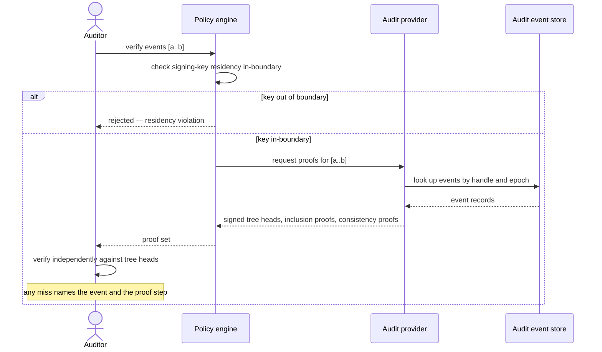

# UC-15 · Cryptographic audit verification — the play

**Purpose:** how DCM answers an auditor's tamper-evidence query — serving signed tree heads and inclusion/consistency proofs from the audit provider, with the signing key pinned in-boundary — on top of [request-realization](request-realization.md). Only the UC-specific mechanics.

> **Use Case:** `governance/audit-merkle-tree-verification` · **Persona:** compliance-auditor.

## What's different in the engine

- **Placement routes to an audit/information provider, and the dispatcher never builds.** The reserve/commit pair is replaced by a **serve-proofs** call. The request reads audit state and returns evidence; no tenant resource is touched.
- **A sovereignty gate on the key, before any signing.** The policy engine checks that the signing key material resides in-boundary; if not, the request is rejected before a tree head is produced.
- **The proof set is the response body.** Tree heads (one per covered epoch), an inclusion proof per requested event, and consistency proofs across heads. The auditor verifies them independently — DCM produces, the auditor checks.
- **Failures are located.** If the provider cannot prove an event, the response names the event and the proof step, so the auditor sees *what* failed, not just *that* it failed.

## Sequence — only the UC-specific part

## What an engineer adds

- **The audit provider** — a transparency-log provider that maintains the Merkle tree over audit events and serves heads and proofs (single-signer v1).
- **The residency policy** — the sovereign-profile rule pinning signing-key material in-boundary. The proof math and the verification contract are the provider's.

## Pointers

- Stage: [udlm request-realization](https://github.com/croadfeldt/udlm/tree/main/docs/flows/request-realization.md). UC source: `governance/audit-merkle-tree-verification`.
- Capability-validation sibling: [udlm uc-21-audit-chain-signed-proofs](https://github.com/croadfeldt/udlm/tree/main/docs/flows/uc-21-audit-chain-signed-proofs.md).
