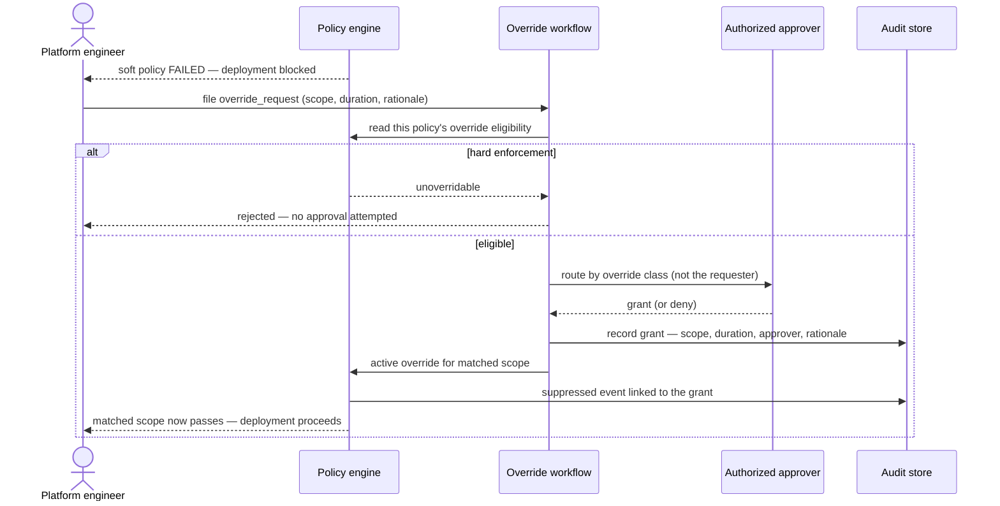

# UC-16 · Policy override approval — the play

**Purpose:** how DCM runs a time-bounded policy override on top of
[request-realization](request-realization.md) — only the UC-specific mechanics.

> **Use Case:** `governance/policy-override-approval` · **Persona:** platform-engineer.

## What's different in the engine
- **A failing soft policy opens a path, not a dead end.** When the policy engine returns a soft-enforcement
  failure, the engineer can file an `override_request` carrying the matched scope, a requested duration, and a
  rationale. This is a modification to the policy-application state, not a new resource.
- **Eligibility read from the policy artifact itself.** The engine reads the target policy's declared
  override rules. Hard-enforcement policies declare no override path, so the request is rejected before any
  approver is contacted.
- **Approval routed by class.** An orchestration/approval policy maps the override class to the authorized
  approver role and routes there — never back to the requester. The engine waits on the human decision.
- **Grant recorded, then honored on re-evaluation.** A granted override is persisted (scope, duration,
  approver, rationale). Subsequent evaluations of the matched scope consult active overrides; a suppressed
  event is written with a link back to the grant so audit can reconstruct what it let through.

## Sequence — only the UC-specific part

## What an engineer adds
- The **override-eligibility declaration** on each policy artifact (or its absence, which means hard/unoverridable).
- The **approval-routing policy** mapping override class to approver role, and the store for override records.
- The **audit link** from each suppressed evaluation back to the grant. Realization itself is untouched.

## Pointers
- Stage: [udlm request-realization](https://github.com/croadfeldt/udlm/tree/main/docs/flows/request-realization.md). UC source: `governance/policy-override-approval`.
