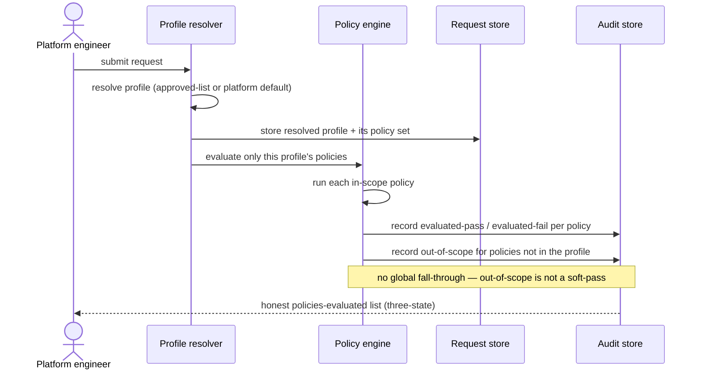

# UC-16 · Policy resolution by profile — the play

**Purpose:** how DCM decides which policies apply and reports them honestly, on top of
[request-realization](request-realization.md) — only the UC-specific mechanics. Validation UC for **DR-E**.

> **Use Case:** `governance/policy-resolution-capability` · **Persona:** platform-engineer.

## What's different in the engine
- **Profile resolution comes first.** The engine resolves the request's profile — an approved-list selection
  or the platform default — before any policy runs. That resolved profile *is* the policy set, selected by
  construction rather than filtered from a global registry at runtime.
- **Evaluation is closed to the profile.** Only the profile's policies are evaluated. There is no global
  fall-through path that could reach a policy outside it.
- **Outcomes are three-state.** Each policy result is recorded as evaluated-pass, evaluated-fail, or
  out-of-scope. Out-of-scope is a first-class outcome for policies not in the resolved profile — it is never
  collapsed into a soft-pass.
- **The audit is the honest ledger.** The policies-evaluated list carries all three states so a reviewer can
  distinguish "did not apply" from "applied and passed".

## Sequence — only the UC-specific part

## What an engineer adds
- The **profile resolver** (approved-list selection plus platform default) and the **by-construction policy
  selection** that binds the profile to its policy set.
- The **three-state outcome recording**, with out-of-scope emitted for non-member policies and no global
  fall-through path. Where these gates sit in the build is unchanged.

## Pointers
- Stage: [udlm request-realization](https://github.com/croadfeldt/udlm/tree/main/docs/flows/request-realization.md). UC source: `governance/policy-resolution-capability`.
