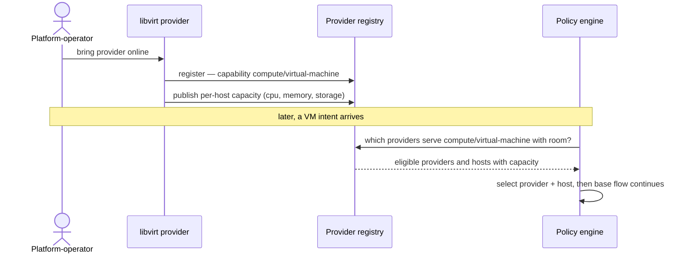

# UC-17 · Provider registration + capability — the play

**Purpose:** how DCM runs this case, on top of [request-realization](request-realization.md) — only the UC-specific mechanics. Here that's the libvirt provider registering capability and per-host capacity into the registry that placement reads.

> **Use Case:** `libvirt-vm-provider/standard/provider-registration-capability` · **Persona:** platform-operator.

## What's different in the engine

- **Registration populates the provider registry.** The libvirt provider registers, advertising the `compute/virtual-machine` capability and per-host cpu/memory/storage capacity — the registry request-realization's Place step already consults.
- **Capacity is placement input, not just metadata.** Placement filters to providers with the capability, then to hosts with room for the intent's cpu/memory/storage, then selects.
- **No change downstream.** Once a provider+host is selected, enrich/reserve/commit are exactly the base flow.

## Sequence — only the UC-specific part

## What an engineer adds

- The provider's registration payload — capability set plus per-host capacity, kept current as hosts fill.
- A placement filter that matches capability then fits capacity to a host; the rest of request-realization is unchanged.

## Pointers

- Stage: [udlm request-realization](https://github.com/croadfeldt/udlm/tree/main/docs/flows/request-realization.md). UC source: `libvirt-vm-provider/standard/provider-registration-capability`.
- Registration mechanics: `docs/specifications/dcm-registration-spec.md`.
