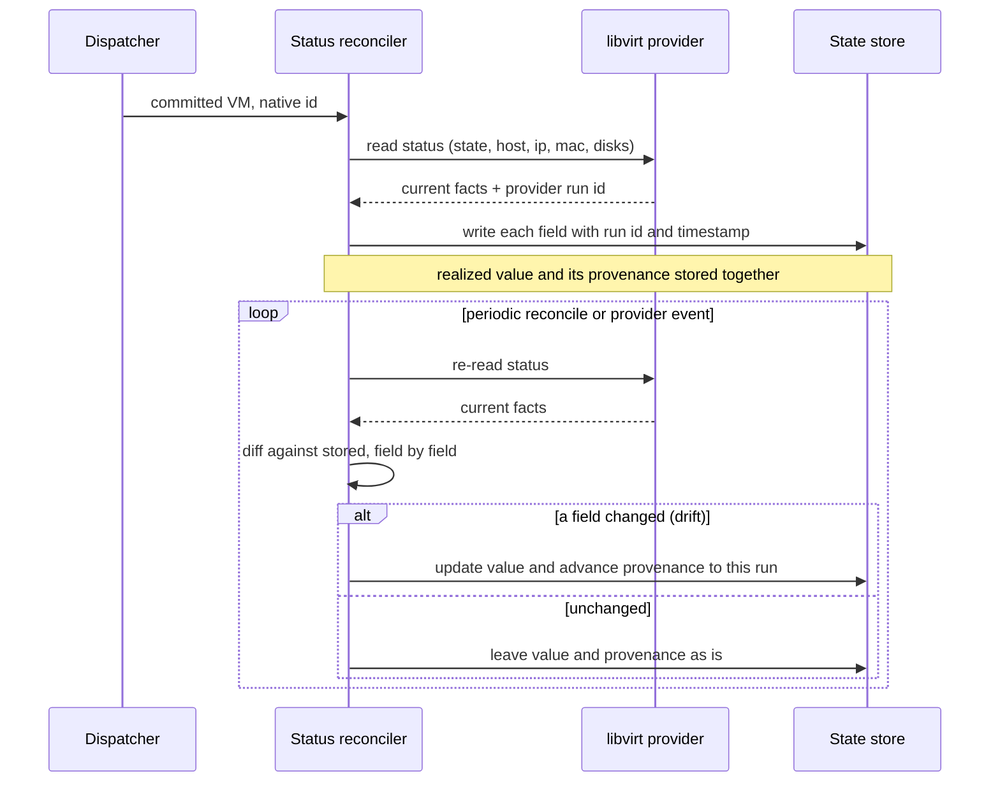

# UC-18 · Realized status with field-level provenance — the play

**Purpose:** how DCM runs the post-commit half — ingesting the libvirt provider's status and stamping provenance on each realized field, then reconciling drift — on top of [request-realization](request-realization.md). Only the UC-specific mechanics here.

> **Use Case:** `libvirt-vm-provider/standard/vm-status-provenance` · **Persona:** auditor.

## What's different in the engine

- **A reconcile path, not just a build path.** request-realization's dispatcher returns native facts once at commit. This case adds a **status reconciler** that keeps reading provider status and writing it back — on commit, on provider events, and on periodic sweeps.
- **Provenance stamped at ingest.** Each field written to the realized record is paired with the **run id and timestamp** of the read that produced it. The state store already carries provenance for requested values; the reconciler extends it to realized values.
- **Drift is a diff, then an attributed update.** A re-read is compared field-by-field to stored status. Changed fields are updated with the *new* run's provenance; unchanged fields keep their existing origin — no blanket overwrite.

## Sequence — only the UC-specific part

## What an engineer adds

- **The provider's status mapping** — which libvirt facts map to `state`, `host`, `ip`, `mac`, and disk-path fields (`dcm-registration-spec.md`).
- **The reconcile trigger** — how often to sweep and which provider events force a re-read; the diff-and-attribute logic itself is the engine's.

## Pointers

- Stage: [udlm request-realization](https://github.com/croadfeldt/udlm/tree/main/docs/flows/request-realization.md). UC source: `libvirt-vm-provider/standard/vm-status-provenance`.
- Four states (Realized side): udlm [`foundations/four-states.md`](https://github.com/croadfeldt/udlm/tree/main/docs/foundations/four-states.md).
