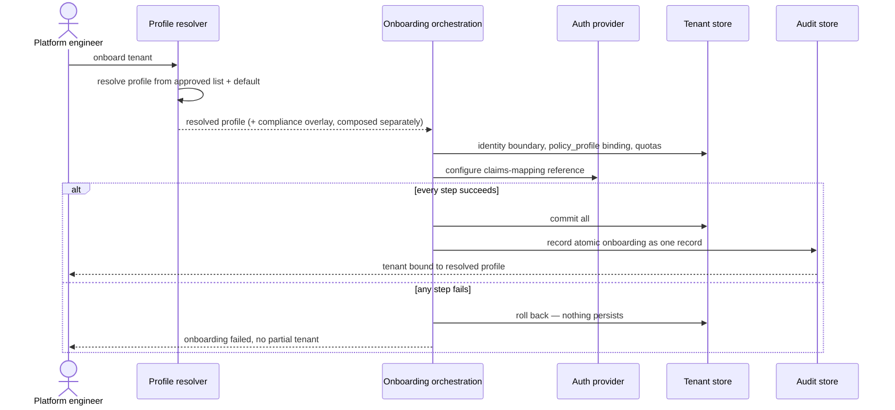

# UC-20 · Profile resolution & atomic onboarding — the play

**Purpose:** how DCM resolves the instance profile and onboards a tenant atomically, on top of
[request-realization](request-realization.md) — only the UC-specific mechanics. Validation UC for **DR-B**.

> **Use Case:** `cross-domain/profile-resolution-capability` · **Persona:** platform-engineer.

## What's different in the engine
- **Resolution reads the instance declaration.** The instance publishes an approved profile list and a
  default. The resolver selects from that list; near-term the default applies instance-wide. Profiles are
  capability sets — comparison is set-containment, not a rank.
- **Onboarding runs as one transaction.** An orchestration-flow policy sequences the identity boundary,
  profile binding (a `policy_profile` DCMGroup), quotas, and auth-provider claims mapping, and commits them
  all-or-nothing. Any failed step rolls the whole onboarding back.
- **The overlay is composed separately.** A compliance/sovereignty overlay is bound alongside the profile, not
  merged into it, so it stays independently visible and auditable.
- **One atomic record.** The successful onboarding is recorded as a single audit record, matching its
  all-or-nothing nature.

## Sequence — only the UC-specific part

## What an engineer adds
- The **profile resolver** over the instance's approved-list + default, with **set-containment** comparison
  (no ranking).
- The **onboarding orchestration** that binds identity, profile, quotas, and auth claims atomically, and
  **composes** the compliance overlay alongside the profile rather than folding it in.

## Pointers
- Stage: [udlm request-realization](https://github.com/croadfeldt/udlm/tree/main/docs/flows/request-realization.md). UC source: `cross-domain/profile-resolution-capability`.
