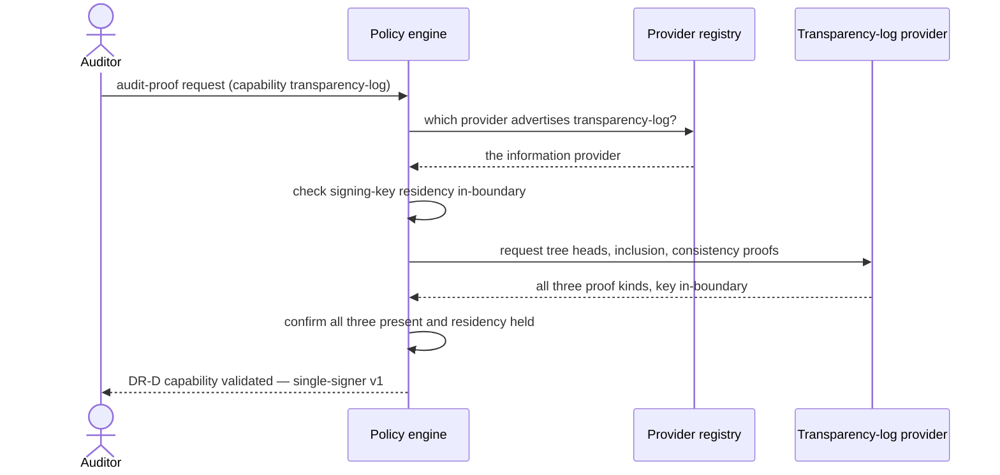

# UC-21 · Transparency-log capability validation — the play

**Purpose:** how DCM demonstrates the DR-D transparency-log capability — a registered information provider selected by capability match, serving all three proof kinds with the signing key in-boundary — on top of [request-realization](request-realization.md). Only the UC-specific mechanics. The verification *act* is [UC-19](uc-15-merkle-tree-audit-verification.md)'s play; this validates the capability is *present*.

> **Use Case:** `governance/audit-chain-proofs-capability` · **Persona:** compliance-auditor.

## What's different in the engine

- **Placement selects on an advertised capability.** The provider registry holds a provider that declares `transparency-log`; placement picks it for an audit-proof request the way it picks a VM provider for a VM — by capability, then policy.
- **The capability contract is all three proof kinds.** DCM validates the selected provider returns **tree heads**, **inclusion proofs**, and **consistency proofs**. A provider serving only some does not satisfy DR-D.
- **Sovereignty is a usability gate.** The in-boundary key policy runs as part of confirming the capability is usable under the sovereign profile — not a separate afterthought.
- **Single-signer v1 recorded as the boundary.** No external-witness cross-check is attempted; the validation asserts what v1 covers and flags equivocation defense as follow-up.

## Sequence — only the UC-specific part

## What an engineer adds

- **The transparency-log provider registration** — declaring the `transparency-log` capability and the three proof kinds it serves (`dcm-registration-spec.md`).
- **The residency policy** — the sovereign-profile rule pinning the signing key. The proof generation and the single-signer boundary are the provider's.

## Pointers

- Stage: [udlm request-realization](https://github.com/croadfeldt/udlm/tree/main/docs/flows/request-realization.md). UC source: `governance/audit-chain-proofs-capability`.
- The verification act: [udlm uc-15-merkle-tree-audit-verification](https://github.com/croadfeldt/udlm/tree/main/docs/flows/uc-15-merkle-tree-audit-verification.md).
