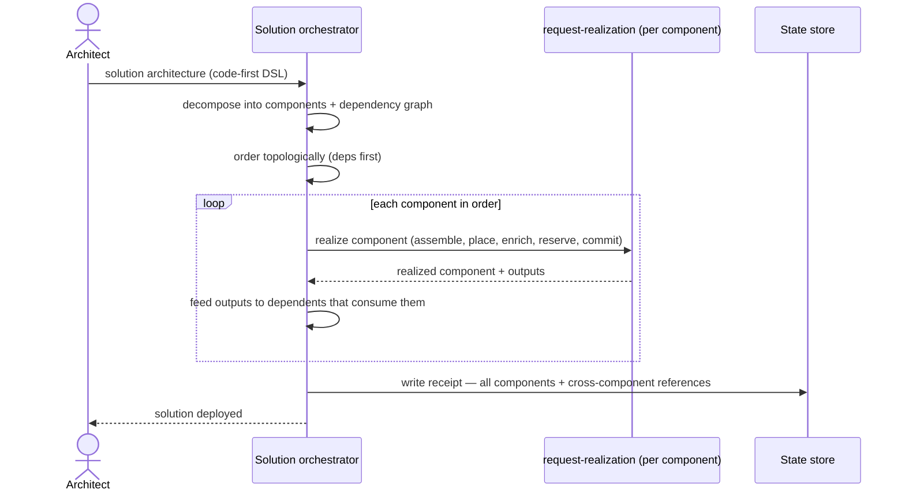

# UC-21 · Solution architecture deployment — the play

**Purpose:** how DCM runs a whole solution — decomposing a code-first DSL into component requests, ordering them by dependency, and running each through [request-realization](request-realization.md), then assembling one wired receipt. Only the orchestration mechanics here; each component's own build is the base flow.

> **Use Case:** `cross-domain/solution-architecture-deployment` · **Persona:** solution-architect.

## What's different in the engine

- **An orchestrator wraps the dispatcher.** request-realization drives one resource end-to-end. This case adds a **solution orchestrator** that decomposes the DSL, builds the dependency graph, and calls request-realization once per component — in topological order.
- **References gate ordering.** A component's request isn't assembled until its upstreams have committed and produced the outputs it consumes (a database endpoint, a subnet id). The orchestrator holds a dependent until its inputs resolve — the wiring drives the schedule.
- **Providers vary per component, and that's fine.** Each component places independently; the app tier may land on OpenShift while the database lands elsewhere. The orchestrator doesn't force one provider.
- **The receipt records the wiring.** On completion the orchestrator writes one realized receipt: every component's realized state plus the cross-component references — which output fed which input — not N disconnected records.

## Sequence — only the UC-specific part

## What an engineer adds

- **The decomposition** — how the DSL maps to typed component requests and dependency edges, and each component's base engineering pattern.
- **Nothing about single-component realization** — assemble, place, enrich, reserve, commit are request-realization's; the orchestrator only sequences them and records the wiring.

## Pointers

- Stage: [udlm request-realization](https://github.com/croadfeldt/udlm/tree/main/docs/flows/request-realization.md). UC source: `cross-domain/solution-architecture-deployment`.
- Four states (per component): udlm [`foundations/four-states.md`](https://github.com/croadfeldt/udlm/tree/main/docs/foundations/four-states.md).
