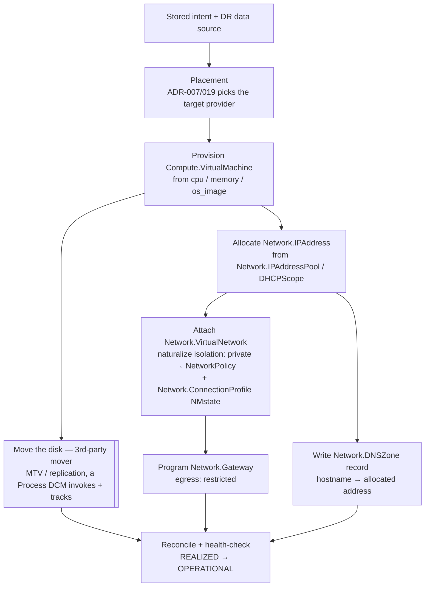
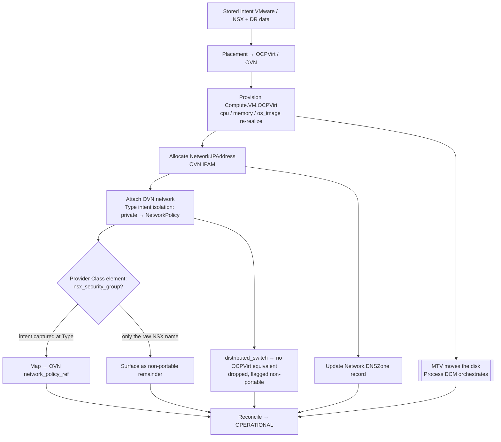

# Workload migration and rehydration — a worked example (and its limits)

**What this is.** The concrete process behind the model's *re-porting* (UDLM ADR-038) and *rehydration*
(UDLM `four-states.md` §5), shown as **one mechanism** with a **complete** part list — not just compute and a
disk, but the **IP allocation, network connection, and DNS** a workload actually needs to come back to life.

The answer to *"can you cast a VMware VM to an OpenShift VM?"* is **"the model enables it, and DCM can
orchestrate it end-to-end — but DCM never moves the bytes itself (a third-party mover does), and how much ports
is a function of the requirements, not a promise."**

---

## Migration and rehydration are the same process

Both **replay stored intent against a target and activate a DR data source to repopulate the data.** They differ
only in *circumstance*, not mechanism:

| | **Migration (re-port)** | **Rehydration** |
|---|---|---|
| **Trigger** | a planned move — new provider, consolidation, exit | loss / DR event / scheduled rebuild |
| **Target** | a *different* provider — requirements or provider state changed | a *different* provider — the one that held the original is offline |
| **Intent source** | the workload's stored requirement set (its original request) | the same stored Intent/Requested/Realized record |
| **Data source** | a third-party mover from the source (MTV, `virt-v2v`) | a DR replica / backup already staged near the target |
| **Identity** | a **new** entity (the source may still exist) | a **new** realized entity, new UUID — the original is gone, so the workload is re-realized from intent. *(A faithful restore from the **Realized** record while its provider is still available can instead preserve the UUID — `RHY-005`, four-states §5.1 — a different scenario than this one.)* |
| **Sovereignty/tenancy** | evaluated for the target | **re-evaluated under *current* policy** (`RHY-001`) — may land in `PENDING_REVIEW` |
| **Ordering** | the dependency graph | the same dependency graph (`entities/service-dependencies.md`) |

**The pivot is intent.** Neither path translates a source construct into a target construct. Both ask what the
workload *needs* — `isolation: private`, an address, a name — and let each provider satisfy it natively. So the
mechanism below is written once; migration and rehydration are two entry points to it.

---

## Set expectations first

- **Enablement, not execution — but automatable end-to-end.** DCM + the model give you the *data framework* to
  plan and drive the rebuild. **DCM never moves the bytes itself** — a **third-party mover** does (MTV,
  `virt-v2v`, backup/restore, storage replication). But that mover is a **Process DCM can orchestrate**: where it
  exposes an automatable interface and a provider/automation naturalizes it, DCM sequences the whole flow as
  **one unattended run**. *"Third party" means not DCM's own byte-mover — not a manual human step.* This requires
  that the providers, the mover's process, and the automation are built for it; absent that, the data step falls
  back to a manual mover.
- **A rebuild, not a lift-and-shift.** You re-realize the workload from its *requirements* on the target's native
  services. The substrate never carries the source's native form across (naturalization boundary, DCM ADR-023).
- **Portability is not 100 %.** Source-specific features with no target equivalent don't port; a
  partial/assisted result is normal. The model's job is to make the *achievable* part automatic and **surface the
  remainder**, not hide it.
- **The starting point sets the ceiling — captured intent vs brownfield.** A workload realized *through* DCM has
  its intent (the request **is** the intent). A **brownfield** resource discovered in the field carries only the
  native construct, so **greening** (DCM ADR-017) must reverse-derive the requirement first, imperfectly. A
  re-port or rehydration is only ever as good as the intent you have.

---

## The parts of a complete re-realization

A workload is not one resource — it is a small graph. A *complete enabled solution* re-realizes every part, each
a real UDLM Resource with its own provider. All types below **exist in the registry today**
(`registry/resource-types/`).

| Part | UDLM type | Portable requirement (Base/Type intent) | Provider realizes | DR / mover role | Migration vs rehydration |
|---|---|---|---|---|---|
| **Compute** | `Compute.VirtualMachine` | `cpu`, `memory`, `os_image` (by standard identity, ADR-035) | a VM provider builds the guest | — (rebuilt from intent) | identical |
| **Disk / data** | `Storage.Volume` (+ DR replica) | `tier`, `min_gib` | storage provider provisions the target volume | **the byte step** — a mover (MTV / replication), a **Process DCM orchestrates** | migration: mover pulls from source · rehydration: replica already staged |
| **IP allocation** | `Network.IPAddress` from `Network.IPAddressPool` (or `Network.DHCPScope`) | `ip_family`, `allocation: dynamic\|static` | an IPAM/DHCP provider (`Network.AddressService`) leases an address | — | migration: **new** address · rehydration: often **reserved/preserved** for the same UUID |
| **Network connection** | `Compute.VM.networks[]` → `Network.VirtualNetwork` (+ `Network.ConnectionProfile` NMstate) | **`isolation: private`, `egress: restricted`** (the private-networking intent) | network provider naturalizes: NSX portgroup **↔** OVN NAD + `NetworkPolicy` | — | reattach to the target segment |
| **Egress / gateway** | `Network.Gateway` | `egress: restricted` | gateway provider programs NAT/edge; emits `external_address` | — | re-establish egress |
| **DNS** | `Network.DNSZone` (records folded in) | the workload's `hostname` / FQDN | DNS provider writes the RR → the new `Network.IPAddress` | — | update the record to the new address |

The `Compute.VM` outputs (`ip_address`, `hostname`, `target_segment`) are the realized payloads the DNS and
network steps consume — the dependency graph passes them downstream in order.

---

## Scoped classes — portable intent vs. the provider element

The example turns on where a datum sits in the **scoped-Class** hierarchy (ADR-038). A `SharedDataElement`
(`{scope, element, schema, values, state}`) attaches at one of three scopes:

- **Base Class** (`Compute`, `Network`) — universal primitives; every provider honors them.
- **Type Class** (`Compute.VM`, the network connection) — the **portable requirement**:
  `isolation: private, egress: restricted` expressed as *what must hold*. The OVN provider naturalizes it to a
  `NetworkPolicy`, NSX to a security group — same intent, native realization. This is the payoff of stating the
  requirement portably instead of storing the vendor construct.
- **Provider Class** (`Compute.VM.VMware`, `Compute.VM.OCPVirt`) — the **provider-specific element**. This is the
  *private-networking Provider Class element*:

  ```yaml
  # Provider Class: Compute.VM.VMware  (provider-authored, illustrative)
  shared_data_element:
    scope:   Compute.VM.VMware          # Provider-Class scope
    element: nsx_security_group          # the provider-specific private-networking datum
    schema:  { type: string }            # an NSX security-group handle
    values:  free                        # provider vocabulary
    state:   curated

  # Provider Class: Compute.VM.OCPVirt  (provider-authored, illustrative)
  shared_data_element:
    scope:   Compute.VM.OCPVirt
    element: network_policy_ref          # the OVN-native equivalent
    schema:  { type: string }            # a NetworkPolicy / NAD reference
    values:  free
    state:   curated
  ```

> **Status.** Scoped classes are **ADR-038 (accepted), not yet a live registry construct** — UDLM ships *no*
> concrete Provider Class (they are provider-authored). So the elements above are the **pattern a provider
> authors**, and the portable `isolation` intent is a greenfield Type-Class candidate. Both are tracked in
> **udlm#199**; until they land, the today-mechanism is `provider_extensions` on the realized entity
> (ADR-PROV-004). Whoever authors the Provider Class does so per the one contribution lifecycle (dcm#60).

---

## Example A — portable migration (Base/Type only)

A VM requested at the **Type Class** with portable requirements only:

```yaml
class: Compute.VM
requirements:                                # all Base/Type SharedDataElements — portable
  cpu:     { min_cores: 8 }
  memory:  { min_gib: 32 }
  storage: [ { tier: ssd, min_gib: 500 } ]   # requirements descriptor (ADR-036)
  os_image: { family: rhel, version: "9" }   # by standard identity (ADR-035)
  network: [ { isolation: private, egress: restricted } ]   # portable private-networking intent
  dns:     { hostname: web-01 }
```

Every requirement is Base/Type-scoped, so the set carries **wholesale**. The flow — DCM orchestrating each part,
the mover included:



**Parts / providers needed:** a VM provider, a storage provider + an automatable **mover** (MTV), an IPAM/DHCP
provider (`Network.AddressService`), a network provider (naturalizes `isolation`), a gateway provider, a DNS
provider. Wire all of them and the re-port runs unattended; the *requirements* port with no loss, and only the
disk **contents** need the mover.

---

## Example B — provider-explicit (VMware on NSX → `Compute.VM.OCPVirt` on OVN)

The reviewer's case. The source VM carries **provider-specific** elements alongside the portable ones:

```yaml
class: Compute.VM.VMware
requirements:
  cpu:     { min_cores: 8 }                              # Base — ports
  memory:  { min_gib: 32 }                               # Base — ports
  storage: [ { tier: ssd, min_gib: 500 } ]              # Type — ports
  os_image: { family: rhel, version: "9" }              # Type — ports
  network: [ { isolation: private, egress: restricted } ]  # Type — ports as a *requirement*
  nsx_security_group: prod-web-tier                      # Provider Class element — needs a target equivalent
  distributed_switch: dvs-prod-01                        # Provider (VMware) — no OCPVirt equivalent
```



1. **The portable subset re-realizes automatically** — cpu / memory / storage / os_image / the *network
   requirement* (`isolation: private`) all have OCPVirt/OVN native realizations. The network requirement ports
   because it was stated at the **Type Class** as *what must hold* — OVN naturalizes it to a `NetworkPolicy`,
   exactly as NSX naturalized it to a security group.
2. **The Provider Class element is surfaced** — `nsx_security_group` maps to the OVN equivalent
   (`network_policy_ref`) *iff* the intent behind it was captured as the Type-class requirement above; the raw
   NSX group name does **not** cross. `distributed_switch` has no OCPVirt equivalent and is dropped, **flagged
   non-portable** — a human decides whether it mattered.
3. **The mover moves the disk — DCM orchestrating it.** MTV performs the VMware→OCPVirt disk migration; DCM
   **invokes and tracks it as a Process** (naturalized like any provider call) and re-realizes the spec around
   it. Wired that way, the disk step runs *inside* the automated flow, not as a manual pause.

The difference between A and B is **not** the mechanism; it's how much of the requirement set was expressed
portably (Base/Type) vs locked to a Provider Class. The model doesn't make NSX portable — it makes the *portion
you expressed as requirements* portable, and tells you honestly what's left.

---

## Rehydration — the same flow, a different trigger

Rehydration reuses **Example A's flow verbatim**, with these deltas that fall straight out of the table above:

- **A new resource on a new provider** — the scenario here is that the provider holding the original is
  **offline**, so there is nothing to restore in place: the workload is **re-realized from its stored intent** as
  a **new entity with a new UUID**, placed on a currently-available provider. Lineage is preserved — the new
  Intent records the source it was rehydrated from (`source_store` / `source_record_uuid`, a `rehydration`
  provenance source, four-states §5.2) — and relationships that pointed at the lost entity re-point to the
  replacement. *(The other case — a faithful restore from the **Realized** record while its provider is still
  available — preserves the same UUID per `RHY-005`; that is a different scenario than this one.)*
- **The DR data is already staged** — the "mover" step is a **replica/backup activation** near the target rather
  than a cross-provider pull, so it is typically faster and lower-loss than a migration's mover.
- **Sovereignty/tenancy re-evaluated under *current* policy** (`RHY-001`) — a rehydration into today's estate may
  hit a residency/tenancy rule that did not exist at original realization, so the entity can land in
  `PENDING_REVIEW` before it proceeds. Migration evaluates target policy the same way; only the *timing* (an
  outage, not a plan) differs.

Everything else — placement, IP allocation, private-network attach, gateway, DNS, reconcile — is the identical
dependency-ordered sequence — **one enabled solution serves both.**

---

## What DCM orchestrates vs. what needs a human

- **Data movement / repopulation** — never DCM's own bytes; always a **third-party mover** (MTV, `virt-v2v`,
  backup/restore, replication). But an automatable mover is **DCM-orchestrated automation, not a human step** —
  the whole flow runs unattended when the mover, its provider, and the automation exist. Only an *un-automatable*
  mover forces a human.
- **The non-portable remainder** — provider-specific features with no target equivalent (`distributed_switch`);
  surfaced, not silently dropped.
- **Brownfield intent recovery** — a resource discovered in the field carries the native construct, not the
  intent behind it; greening (ADR-017) reverse-derives the requirement, imperfectly.
- **Advanced rebuilds** — where even the requirements need reshaping; the original request (or recovered intent)
  is still the starting point, not a blank page.

---

## References
- UDLM **ADR-038** — the scoped-Class model (Base/Type/Provider Class + `SharedDataElement`) + *re-porting*.
- UDLM **`four-states.md` §5** — rehydration: replay the stored record through the dependency graph, preserve the
  UUID (`RHY-005`), re-evaluate sovereignty under current policy (`RHY-001`).
- UDLM **`entities/service-dependencies.md`** — the dependency graph that supplies the rebuild order for both
  paths.
- UDLM network types — `Network.IPAddress`, `Network.IPAddressPool`, `Network.DHCPScope`, `Network.DNSZone`,
  `Network.VirtualNetwork`, `Network.ConnectionProfile`, `Network.Gateway`, `Network.AddressService`.
- DCM **ADR-020** (migration & operational gating), **ADR-023** (provider naturalization boundary),
  **ADR-007/019** (placement), **ADR-017** (greening / brownfield discovery).
- **udlm#199** — the greenfield the private-networking example needs backed by real types (portable `isolation`
  intent + the private-networking Provider Class element). **MTV** — the third-party disk mover.
